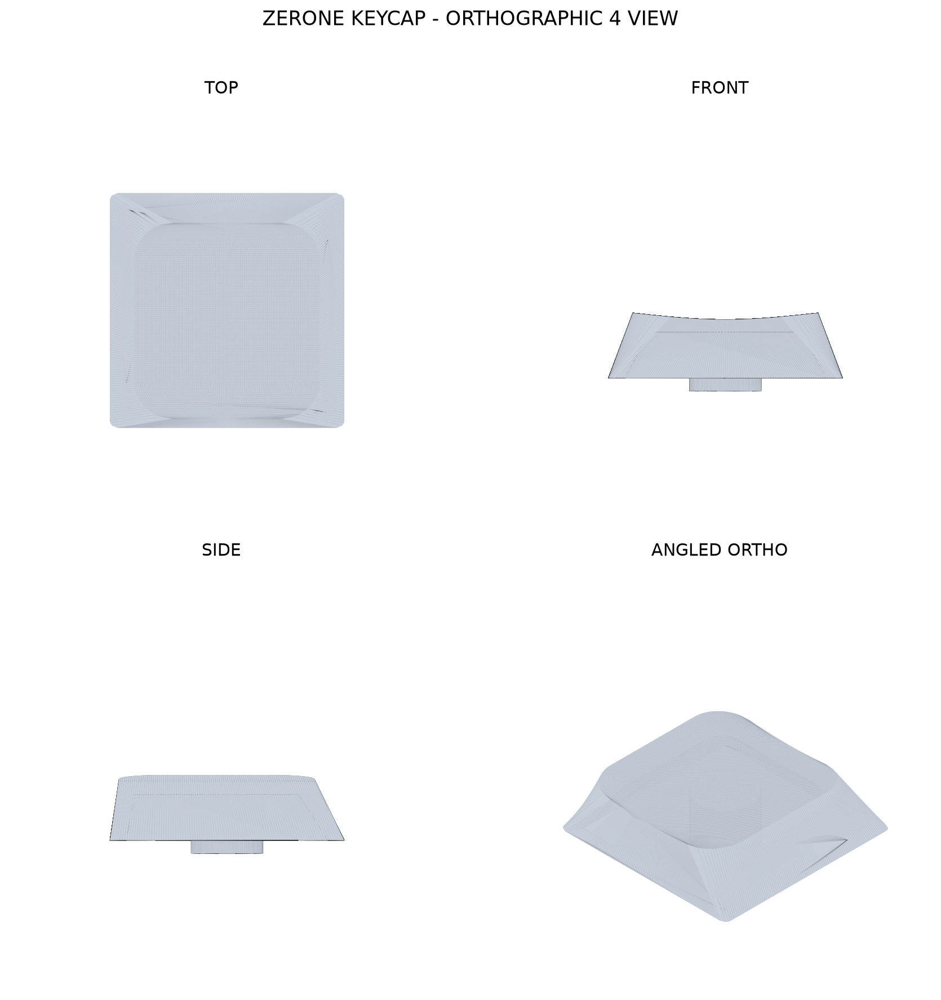
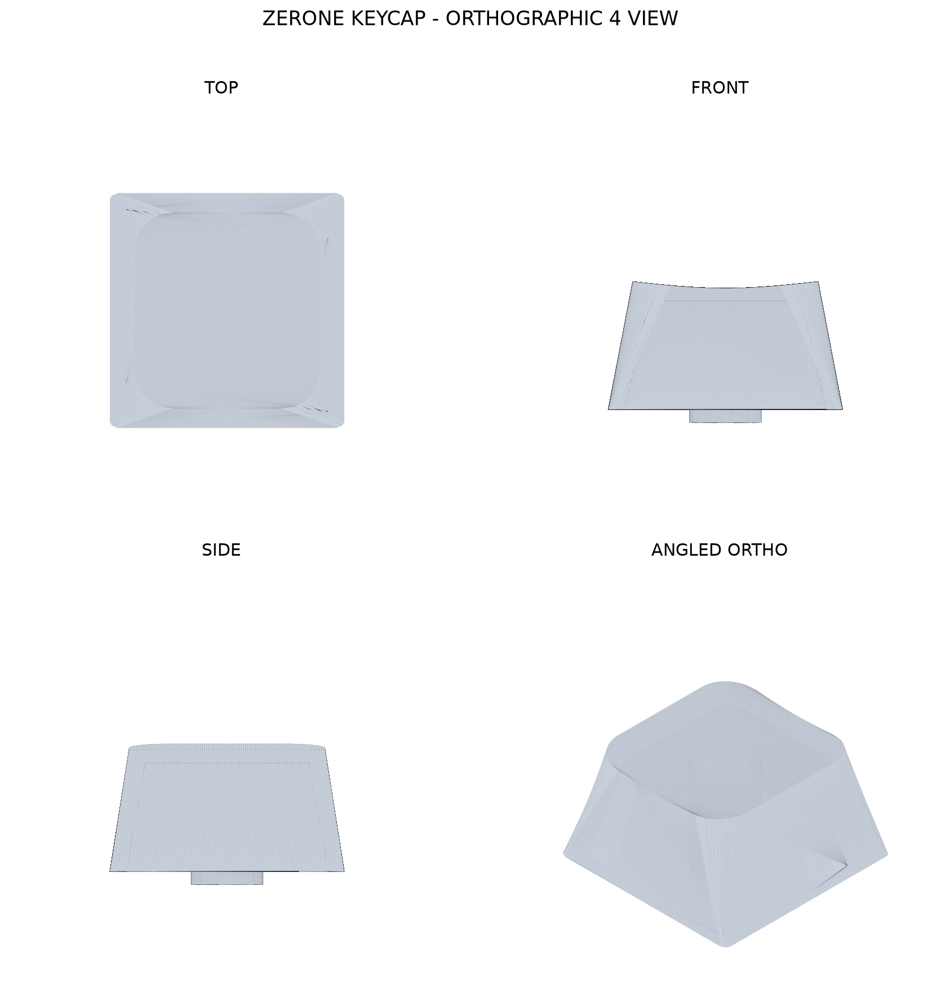

# Keycap Generator

This is a small parametric generator for low-profile Cherry MX-compatible keycaps. Each `.conf` file defines one cap variant and produces both an STL for printing and a PNG render for quick GitHub preview.

## Renders

### JWA

### MX

## Parameters

Variables:
- post_height: 1.0
- post_diameter: 5.6
- post_cross_size: 1.35
- base_width/base_length/base_x/base_y: 18.2, 18.2, 0.0, 0.0
- base_corner_radius: 0.6
- top_width/top_length/top_x/top_y: 14.4, 15.2, 0.0, -0.8
- top_corner_radius: 3.0
- top_concave_depth: 0.5
- top_concave_axis: x
- sidewall_thickness: 1.25
- top_thickness: 1.5
- keycap_height: 5.0
- surface_resolution: 96
- post_sections: 256
